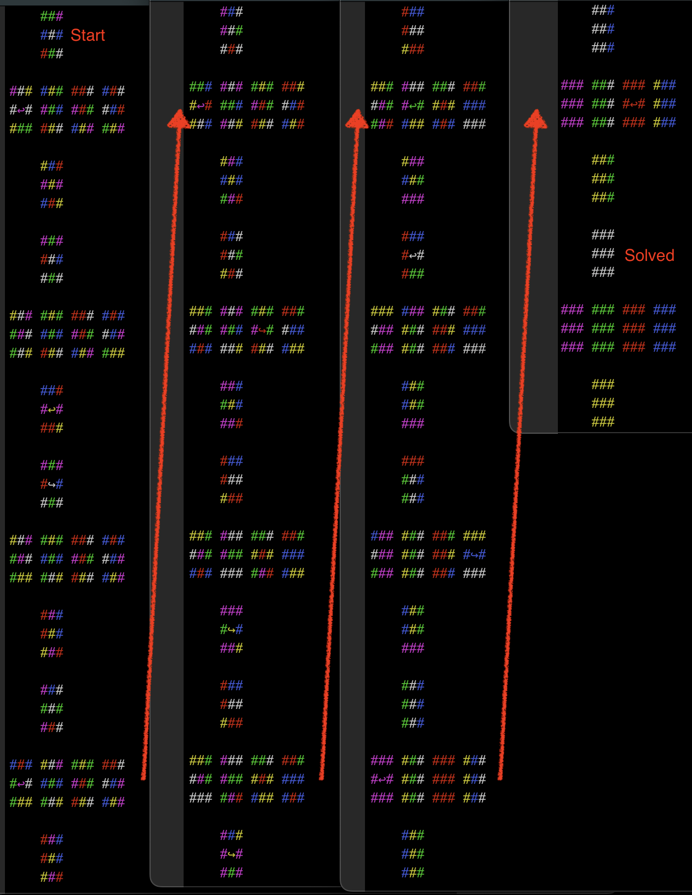

# Rubics Cube Solver

This is my rubics cube solver written in rust

Run:
```
cargo run
```

Run optimized:
```
cargo build --release && time ./target/release/rubics-solver
```

Some magic numbers:
```
Move, Permutations previous, Permutations next, Hash collisions, Collisions total, Total permutations
1, 1, 12 0, 0, 13
2, 12, 114 30, 30, 127
3, 114, 1068 300, 330, 1195
4, 1068, 10011 2805, 3135, 11206
5, 10011, 93840 26292, 29427, 105046
6, 93840, 878880 247200, 276627, 983926
7, 878880, 8221632 2324928, 2601555, 9205558
```
The permutations match to what is found in https://oeis.org/A080602 , so the algorithm should be correct.

Screenshot of the program and its colored ascii output:


